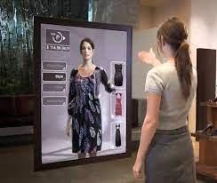

# UnrealShopping

Unreal Shopping is a virtual fit-on room application created using Unreal Engine 5.

## Problem Domain
Online clothes shopping has certain disadvantages that we are aware of.
* We can choose sizes, but we don't know how exactly it will fit us.
* It looks good on that model, but will it look good on me?
* Sure, we can return them if it does not suit us, but that is just extra work.

__The answer is virtual fit-on rooms. And in this project I will explore some options that will aid the industry in the long run.__

The general approach of a finished product would work in the following general pattern.

* The users can use the application to create a 3D model that resembles the body shapes of themselves.
* The users can choose and apply clothes onto the model to see how they would fit.

__The problem of creating a custom model and clothing it, contains a number of complex subproblems. Since this project is done with the collaboration of LiveRoom, my goal is to create a well-documented, modular and extensible software that encompasses the whole pipeline, however primitive, with room for improvement.__

## Solution

This project will consist of 3 main components,
* Model creation
* Clothing
* Presentation

All 3 of which will be independant from each other. And everything will be built using Unreal Engine 5. (UE5)

### 1. Model creation
This part is reponsible for creating a 3D model with a body shape that is as much similar to the user's body shape as possible.
* In the priliminary phase of the project, I will implement this part of the project to generate a 3D model using the body measurements input by the user. Metahuman will be used possibly.
* Components from both Metahuman and Makehuman are planned to be used.

### 2. Clothing
* This part is responsible for creating and applying clothing onto the 3D model, that is as physics-realistic as possible. Further research pending.

### 3. Presentation
* This part is responsible for viewing the created and clothed model in different environments and lighting conditions. This part is aimed to be as customizable as possible for the user.

# Time plan
The weeks are numbered relative to the semester.

* Week 3 : Researching on the topic and Presenting the general UI design in UE5.
* Weeks 4 - 7 : Implementing the model creation
* Weeks 8 - 11 : Implementing clothing system
* Weeks 12 - 14 : Implementing the presentation component of the software

# References

* [Unreal Engine 5](https://www.unrealengine.com/en-US/unreal-engine-5)
* [Metahuman](https://metahuman.unrealengine.com/)
* [MakeHuman](http://www.makehumancommunity.org/)